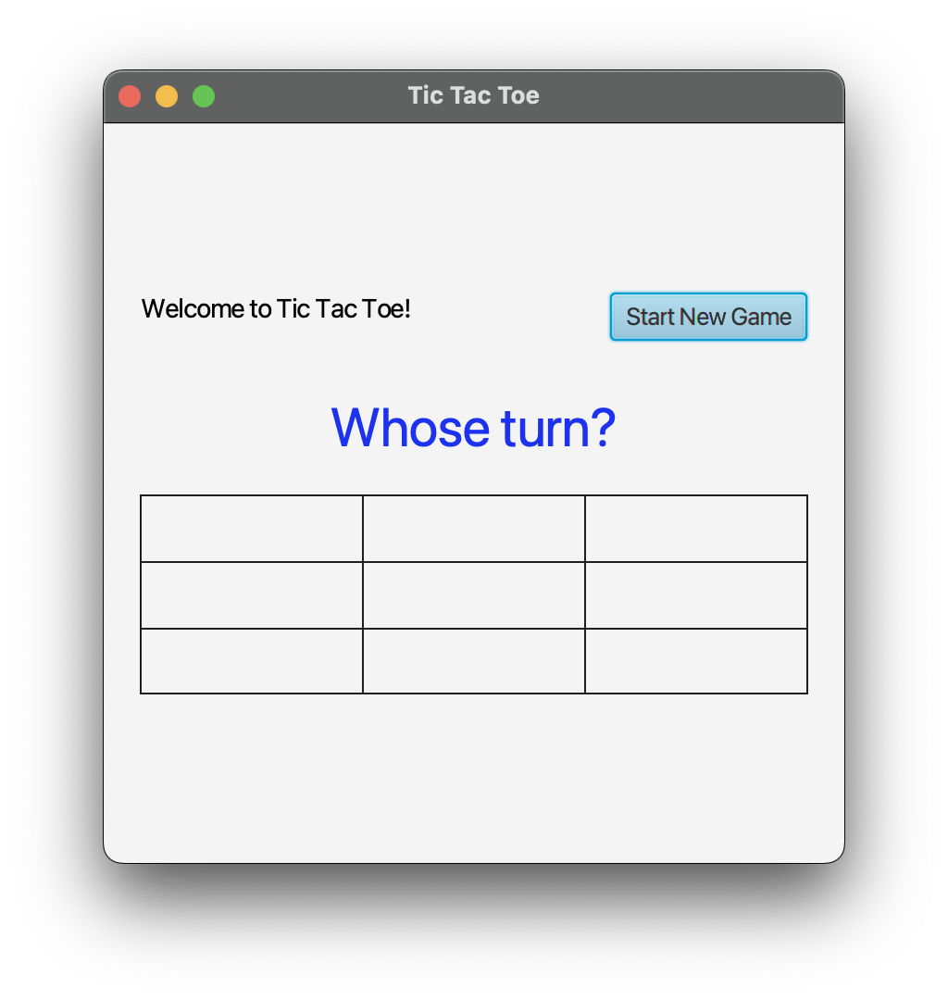

# Lab 4 — GUI programming

For this lab, you're going to build a Tic-Tac-Toe game using a graphical user interface (GUI).
This lab walks you through building the GUI using [JavaFX](https://openjfx.io/), a platform for creating client desktop applications in Java.

This lab will give you useful experience with JavaFX that should serve you well on Project 2.
So, while I've given you a bunch of code snippets to move you along, please make sure you understand what they are doing.

Also, since I've found it difficult to get in-IDE Javadocs about JavaFX components, you may also want to bookmark
the JavaFX API reference. https://openjfx.io/javadoc/20/

**You are also free to use Chat-GPT to help you create your GUI components, but be warned that it will confidently lead you astray if it doesn't know how to do something.**

I have given you some of the starting GUI components already—you will implement the game using those components.
Some aspects of the GUI will also need changing as you implement the game.

"Implementing the game" here is mostly going to be getting your existing code from Lab 2 to work with the GUI that I've given you.

To that end, there is a _reflective_ portion to this lab as well as a programming portion.
When you worked on Lab 2, we talked about writing loosely coupled classes.
Specifically, the emphasis was on separating "business logic" of your application from the "view" or "presentation" layer.
In this lab, we will "face the consequences" of our designs, so to speak.
Throughout the process, you should introspect on whether and how your implementation is made easier or more difficult by aspects of your design from Lab 2, aspects of my starter code, or limitations from JavaFX.

This lab directly addresses the following course learning objectives:

* Use modularity in building a project
* Use Application Frameworks

## JavaFX Overview

We've already talked about JavaFX during lecture, but some of the key points are worth re-describing here.

* In a JavaFX application, each window of the application is called a `Stage`.
* Each `Stage` can show a single page called a `Scene`.
* The layout of a `Scene` is described in an `FXML` file. FXML is an HTML-like syntax for describing a user interface layout. The "elements" in an FXML file won't look like the HTML elements you're used to (`<div>`, `<p>`, etc.), but the idea is the same. Instead, FXML files have elements that are defined in JavaFX, like `AnchorPane`, `TextField`, etc.
* Each "page" in your application is accompanied by its own `.fxml` file. So for example, if you had a "login" page and a "news feed" page, you would have separate `.fxml` files for each of those pages.
* Each `.fxml` file is linked to a *controller*, a Java class where you can do things like initialisation logic, add event listeners to components, and so on.
* While you _can_ directly edit FXML files in the IDE, you will likely want to make changes to your layout using _SceneBuilder_.

[Download and install SceneBuilder](https://gluonhq.com/products/scene-builder/). Make sure to choose the appropriate installer for your operating system.

## Starter files

Obtain the starter code from the following GitHub classroom link: **LINK IN CANVAS**

Unlike our other projects, this starter project was created using _Maven_, a package management and project build tool for Java projects. This is done for two reasons:

1. It's worth having some experience with a build tool like Maven.
2. Without using Maven, you would have to download a bunch of very specific dependencies for JavaFX. Since we're doing Desktop development, you would need to choose the right versions for your operating system and architecture. Using Maven offloads that to the IDE to handle.

The starter code is organised as follows. Please take a few moments to study this listing.

- `src` — Our code is in this folder as usual
    - `main`
      - `java` — This is our "sources root"
        - `tictactoe` — This is the "top level package" in this project
          - `TicTacToeApplication.java` — This is the "driver" for this project. I haven't called it `Driver`, because it appears to be convention in JavaFX applications for the starting point to say "Application". Its job is simple: load the page defined by `mainpage.fxml` and display it.
          - `MainPageController.java` — This is the controller linked to the main page (the page you see when you run `TicTacToeApplication`). This is the file where you will handle user interactions and send that info to your models, and where you will cause the GUI to update in response to behaviours from your models.
      - `resources` — This where other "resources" will go. In a JavaFX application, this includes the FXML files that define pages.
        - `tictactoe` — Following a similar structure to the source code, we have a `tictactoe` package for pages.
          - `mainpage.fxml` — This is the FXML file that defines the layout of the main page. You can open this and look at it—it's just an XML file. A lot of it will look alien to you. **That's fine.**
            - You will typically not edit this file directly. You'll open and edit it using _SceneBuilder_.

## Core tasks

When you first get the program up in IntelliJ, you can run it from the `TicTacToeApplication` file. You should see window like the following pop up.



This is roughly what the window will look like during the game.
Open the `mainpage.fxml` file using SceneBuilder to explore how this file can be edited.

### 1 "Start New Game" behaviour

Right now, the empty board and two messages showing the current player's turn and the "Win message" are already rendered in the Scene.
The first thing we'll do is change this behaviour so that those components only appear when the game has _begun_.

To do this, we need to know when the "Start New Game" button is clicked.

**TASK 1.1 Add an event listener to the `Button` component**

Open `mainpage.fxml` in SceneBuilder and click on the "Start New Game" `Button`. On the right-hand-side you should see a few collapsible forms pop up: **Properties**, **Layout**, and **Code**. Take a few moments to explore the available options.

Register an event handler for the button's action. Expand the **Code** menu for the button. The `Button` supports a number of actions, but the default "action" is to click on the button. In the **Code** menu, look for the **On Action** field, and type in `handleStartNewGame`. Press `Ctrl/Cmd+S` to save your changes.

What we have done in this step is tell the `Button` that whenever it is clicked, the method `handleStartNewGame` must be executed. But where should that method be written, and how does the `Button` know where to find it?

**Open `mainpage.fxml` in IntelliJ itself.** We won't make too many edits here ourselves, but it's worth seeing the structure of the file.

There are two things I want you to notice in this file.

First, on line 15, see the declaration of the root component.

```xml
<VBox alignment="CENTER" prefHeight="327.0" prefWidth="428.0" spacing="20.0" xmlns="http://javafx.com/javafx/19" xmlns:fx="http://javafx.com/fxml/1" fx:controller="tictactoe.MainPageController">
```

It's a `VBox` (vertical box) component, in which all the child components are stacked vertically. Note the `fx:controller` bit at the end of the line. This attribute on the `VBox` tag is responsible for _linking_ the `MainPageController` Java class with this `VBox`. That means the `MainPageController` class will handle things like user events within this `VBox` and updating what is displayed.

Second, look for the `Button` component. 

```xml
<Button defaultButton="true" mnemonicParsing="false" onAction="#handleStartNewGame" text="Start New Game" textAlignment="CENTER">
```

Notice that it has an `onAction` attribute with the value `#handleStartNewGame`. Also notice that the method name is highlighted as an unknown symbol—this is because it hasn't been written yet.
We are now ready to write this event handler.

**Open the MainPageController.java file**. Write the following method:

```java
@FXML
public void handleStartNewGame() {
    System.out.println("Button was clicked!");
}
```

Run the program, and click on the "Start New Game" button. You should see the `"Button was clicked!"` message print out to standard output.

The `@FXML` annotation communicates that this method is linked to a JavaFX component, meaning that we will rarely, if ever, call this method ourselves. The JavaFX platform will handle calling this method when the button is clicked, much like your browser handles "onClick" events for HTML buttons.

**TASK 1.2: Show "game" components only when Start New Game is clicked**

In SceneBuilder, select the following components by pressing Shift and clicking on them:

* The `Text` component saying "Whose turn?"
* The `GridPane`

Right-click on these components and in the drop-down menu that appears, choose `Wrap In --> VBox`. You're basically wrapping these into a `VBox` component of their own.

(You'll notice that the "Whose turn?" message became left-justified. That's because it has a new parent (`VBox`) whose alignment needs to be adjusted. I'll let you handle that.)

Select the new `VBox` wrapper that you created. Again, the right-hand-side column will appear with a bunch of options for that `VBox`. Expand the **Properties** menu, and _uncheck_ the `Visible` option.
This means that entire `VBox` is invisible by default. You can save the `fxml` file and run the program to confirm.

Now, back in SceneBuilder, expand the **Code** menu for the `VBox` containing the player turn message and the game grid. Find the text field titled `fx:id`. Give it the value `game`.

This is one of the most powerful features of JavaFX. But giving it this id value, we can now manipulate the `VBox` programmatically.

To do this, open the `MainPageController` once again. Create a new instance variable:

```java
@FXML
private VBox game;
```

You don't need to initialise this instance variable yourself. JavaFX sets this up so that you now have a reference to that entire VBox.

Modify your `handleStartNewGame` event handler to set the `game`'s visibility to `true`: `this.game.setVisible(true);`

Run the program again, and now clicking the "Start New Game" button should make the game grid and the "Whose turn?" message appear.

### 2. Incorporating game logic

We are now ready to incorporate game logic into our application. I'm going to leave this part somewhat open for you to handle on your own, and you can work with classmates if you so choose.

We will make the following simplifications to the game just for the sake of time:

* The board will only ever be 3x3 (which is currently what our GUI shows)
* The players will only be referred to as "X" and "0"

With these changes, there shouldn't be any need for any functionality other than the tic-tac-toe Board.
Copy over this functionality from your Lab 2 source code.

Complete the following tasks:

**TASK 2.1: Add click listeners to each "box" in the `GridPane`. Each click should place an "X" or an "O" in that box, alternating.**

**Hint:** The `GridPane` is a "layout" component in JavaFX. It's used to organise components into a grid. I made it have visible borders for clarity, but in reality there's a whole lotta nothin' in those grid cells. You should go ahead and add components in each grid cell. For example, simple `Label` or `Text` elements may do the trick, or if you want nice visual effects of clicking a button, you can add `Button` elements.

Doing this 9 times via drag-and-drop can be annoying, so you can also do this programmatically as part of an initialisation step.

To do this,

* Create an `@FXML`-annotated instance variable that refers to the `GridPane`, in the same way you added one for the `VBox` earlier. This means you need to give the `GridPane` an `fx:id` in SceneBuilder.
* Create a new method called `initialize` in the `MainPageController`. This method is automatically called when the view is initialized. Inside this method, you can use a for loop to dynamically add elements to the `GridPane`.

```java
@FXML
public void initialize() {
    for (int i = 0; i < this.gridPane.getColumnCount(); i++) {
        for (int j = 0; j < this.gridPane.getRowCount(); j++) {
            // Create a new Button with no text
            Button button = new Button("");
            // Make the button really wide, regardless of its text
            button.setMaxWidth(Integer.MAX_VALUE);
            // Add the button to the grid pane
            this.gridPane.add(button, i, j);
        }
    }
}
```

**Hint:** Now you need to add event listeners to the clickable items within the `GridPane`. Previously, we registered a function in the `fxml` file itself, but this time we're creating the elements _dynamically_ (as in, when the code is running). So the `fxml` file doesn't know about these buttons. So we need to dynamically attach a listener to each button.

You can do this by attaching an `EventHandler` object to each `Button` as you create it. You can either manually create a class that `implements EventHandler` and implement its `handle` method (á la Command Design Pattern). Or you can use a lambda:

```java
@FXML
public void initialize() {
    for (int i = 0; i < this.gridPane.getColumnCount(); i++) {
        for (int j = 0; j < this.gridPane.getRowCount(); j++) {
            // Create a new Button with no text
            Button button = new Button("");
            // Make the button really wide, regardless of its text
            button.setMaxWidth(Integer.MAX_VALUE);
            
 ---> NEW   // Add the event listener 
            button.setOnAction(e -> button.setText("Clicked!"));
            
            // Add the button to the grid pane
            this.gridPane.add(button, i, j);
        }
    }
}
```

*What's the `e` in the lambda above?* All event handlers can be optionally implemented with an `Event` parameter. This parameter gives you some access to the "source" of the event (say, if you wanted to look at the current text of the button or something). You can write the lambda without the parameter if you so choose.

Note that the approach directly accesses the `button` variable inside the lambda. It creates a new event handler for _each_ button. So if you need the coordinates for the button, you would need to use the `i` and `j` variables and send that info to your `Board` class (or whatever you've called it) that handles game logic. **You should not do all of this inside the lambda.** You should create a private helper function to abstract out that behaviour.

Another approach is to declare a _single_ event listener that you will use for _all_ buttons in the grid. You can do this creating the listener as a separate object of type `EventHandler<ActionEvent>`, like so:

```java
EventHandler<ActionEvent> handleButtonClick = e -> {
    // Now you don't have direct access to the button, so you
    // need to "obtain" it.
    Button clicked = (Button) e.getSource(); // get the thing that was clicked
    
    // Find the row and column in the GridPane that this button appears in    
    int row = GridPane.getRowIndex(clicked); 
    int column = GridPane.getColumnIndex(clicked);
    
    // TODO: Use the row and column along with your Board/Game functionality
    // to implement the game.    
}
```

Then the `handleButtonClick` is a single listener that you apply to _all_ buttons in your initialize step.

```java
// ... rest of the initialize is the same

button.setOnAction(this.handleClick);
```

This is a fundamental benefit of lambdas: we are easily able to "save" a reference to a function so that it can be used later or multiple times.

**TASK 2.2: Synchronize the GUI with the game state.**

* The `Button`s in the `GridPane` should display noughts and crosses according to what the Board model believes the game state is.
* The "Whose turn?" message should say "Current player: X" or "Current player: O", as appropriate as the game progresses.
* That text component is a convenient place to communicate messages to the user (e.g., error messages, victors, game ending in a draw).
* When the game ends, the `GridPane` should be disabled so that no further moves can be made (Hint: `this.gridPane.setDisabled(true)`)
* When a new game starts (say, after the previous game ended or maybe even before), the `GridPane` should be cleared (i.e., its `Buttons` should not have the old text in them).

Here's a bit of code to help with that last step:

```java
// This code gets all the "Button" children of the GridPane and
// sets their text to empty strings.
private void resetGrid() {
    this.gridPane.getChildren().stream().filter(n -> n instanceof Button)
                .map(n -> (Button) n)
                .forEach(b -> b.setText(""));
}
```

**Bonus**:

If you're interested, you can also add some CSS styling to your application. It follows the same rules as CSS you may be familiar with for the Web. See [this page](https://openjfx.io/javadoc/11/javafx.graphics/javafx/scene/doc-files/cssref.html#introscenegraph) for details. 

## Submission

As usual, you will demo this to me during lab. Since your TicTacToe logic is tested already from Lab 2, I won't look too closely at your tests.
But in the process of transferring your logic over to the GUI application, you may make some changes to the models.
These changes may introduce bugs. They certainly did when I did this lab. So you should still use testing to ensure that the game works correctly.

When you demo your lab to me, I will also expect a verbal reflection on what aspects of your design from Lab 2 helped or hindered your progress on this lab.
