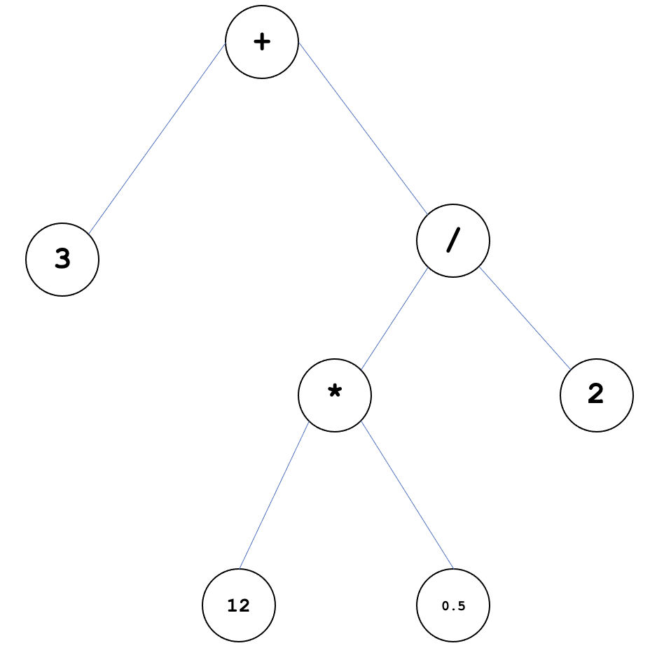

# Project 1 — Prefix notation calculator

In this project you will build a text-based calculator. Please read this project spec carefully in its entirety
before commencing work on the project.

## Learning objectives

This project will test the following objectives directly:

* Develop and properly organise multi-source file projects 
* Use modularity in building a project
* Use module-level testing
* Use polymorphic methods and interface types
* Individually write and test mid-sized object-oriented software modules of a professional quality,
using a standard OO programming language, and using the concepts listed above

Additionally, the project will give you practice with _design patterns_. Specifically, the **Composite** design pattern.

## Project overview

You will build a text-based calculator that accepts compound mathematical expressions from the user with
support for maintaining operation history.
The key features that you must support are as follows:

### Arithmetic operators

The calculator must support the following arithmetic operators.

* Addition `+`
* Subtraction `-`
* Multiplication `*`
* Exponentiation `^`
* Division `/`
* Modulo `%`

### Compound expressions

The calculator must support _compound expressions_ written in _prefix notation_.

**What's a compound expression?**
A _binary expression_ is an expression that has two operands: e.g., `3 * 5`.
A _compound expression_ combines multiple binary expressions into one larger expression,
e.g., `3 + 12 * 0.5 / 2`.

The notation that you're used to for arithmetic expressions is called _infix notation_, i.e.,
the operator (`+`, `-`, etc.) comes between the two operands. Parsing a compound expression in infix
notation is quite a complicated task. Therefore, we will be using _prefix notation_ for all binary expressions.

In _prefix notation_, binary expressions are written as follows: `+ 5 10`. This expression applies the `+` operator
to the following two values (kind of like a function call), and evaluates to the value `15`.

**Compound expressions in prefix notation.** This makes our lives a lot easier when parsing compound expressions.
Consider the expression from above: `3 + 12 * 0.5 / 2`.  In prefix notation, this would be written as:
`+ 3 / * 12 0.5 2`

This may look pretty weird to read at first, but it does make parsing significantly easier. There's no brouhaha
about operator precedence; you can just read the expression left-to-right.
The structure means that you can parse an expression with the following recursive algorithm:

```
Read an operator
Recurse for first operand
Recurse for second operand
```

Note that the two operands might _themselves_ be expressions that need to be evaluated (hence we recurse instead of
just "reading" the operands).

So the expression `+ 3 / * 12 0.5 2` would be evaluated as follows:

```bash
+ 3 / * 12 0.5 2
+ 3 / 6 2          // * 12 0.5 is evaluated to 6
+ 3 3              // / 6 2 is evaluated to 3
6                  // + 3 3 is evaluated to 6
```

### User interface

When the application starts up, simply print the character `>`, and wait for the user to enter a command on the
same line.

When the user has entered some text and hit the `Enter` key, grab their input and evaluate the expression.
If the expression is invalid and your parsing runs into an error, print an informative error message and prompt for
another command. Do _not_ simply print the stack trace of an exception if something goes wrong.

### History

You will also support calculator history. That is, the calculator should be able to remember the last `n` expressions
it evaluated, where `n` is set when the application is initialised (e.g., as an input to a constructor of the appropriate
class).

The user should be able to ask for the calculator's history by entering the command `history`. The history will be
printed as the `n` most recent expressions that were evaluated, in order of most recent to least recent. If fewer than
`n` expressions have been evaluated so far, then print all expressions.

For example:

```
> + 5 5
+ 5 5 => 10
> + 5 * 10 2
+ 5 * 10 2 => 25
> history
A. + 5 * 10 2
B. + 5 5
> A
+ 5 * 10 2 => 25
```

Note that the "references" to older expressions can't be numbers. You need to be able to tell if the user is 
choosing an older expression or if they're actually typing in a number to be "evaluated" (after all, a number
is a valid expression). For that reason, you will label old expressions in the enumerated history using upper-case
letters.

## Design considerations

As usual, there are expectations of software quality going beyond functional correctness. This includes the following:

**IDE warnings.** There should be no SonarLint or IDE warnings in your final submission (and no warnings should be
suppressed).

**Documentation.** All public methods and fields should be given a meaningful Javadoc comment explaining its purpose.
For methods, the @return, @param, and @throws tags should be used appropriately.

**Checking method inputs.** For all public methods or constructors that take input parameters, the validity of the
input parameters should be checked. If the input is invalid, throw an `IllegalArgumentException` with an appropriate
error message.

**Testing.** Your code should be tested. All non-TUI aspects of your code-base should achieve 100% branch coverage.
(We will talk about how to enable this in class.) Your test suite is subject to the same software design guidelines
as the rest of your code (except you don't have to write Javadocs for test methods).

**Module design.** By "module" here I mean "any named subroutine or collection of subroutines". This includes packages,
classes, and methods. I will assess your submission by manually reading through the code-base. I will look for evidence
of loosely coupled, cohesive modules, as well as for attentiveness to the _Effective Java_ items we talk about in class.

**Design patterns**. You are expected to implement this project using the
**[Composite design pattern](https://refactoring.guru/design-patterns/composite)**. We will talk about this more in class.

You will parse the given expression and use the composite design pattern to store the expression as an _expression tree_.
Conceptually, an _expression tree_ looks something like this:



Each node is an expression. Some nodes are binary expressions, i.e., they have left and right children, each of which are 
also expressions. All nodes can be "evaluated" to arrive at a value. Some nodes are constants, which don't need further
evaluation—they can simply return the value they hold.

## Implementation details

As usual, the entry point for your program should be a `Driver.java` class in the `main` package.
Additionally, there is a `test` package where all of your test files will go (within further subdirectories if you so
choose).
I have set up this structure for you in the GitHub classroom assignment. Accept it using this link: **LINK IN CANVAS**.

## Grading breakdown

The project is worth 10 points. The points are distributed as follows:

* 5 points for functional correctness. I will run your `Driver` class and go through a pre-prepared sequence of test
commands, including erroneous commands and edge cases.
* 3 points for tested-ness. All non-TUI aspects of your project should have 100% branch coverage. This score will be
computed as a simple percentage of branch coverage.
* 2 points will be based on my manual read-through of your program. I will grade it for design, clean code, clarity,
and anything SonarLint can't catch (e.g., poor variable names, meaningless Javadocs, and so on).

On top of this, I will deduct 2 points off the top if there are any warnings from SonarLint or from the IDE in general.
